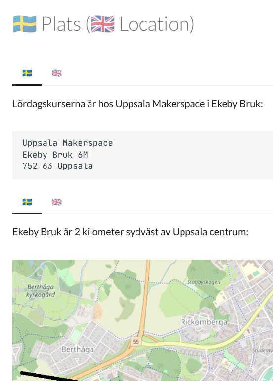
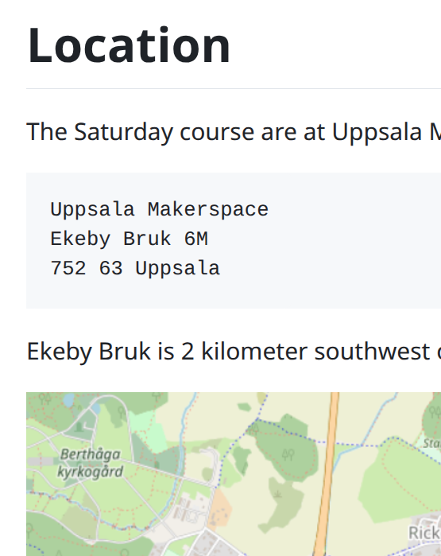
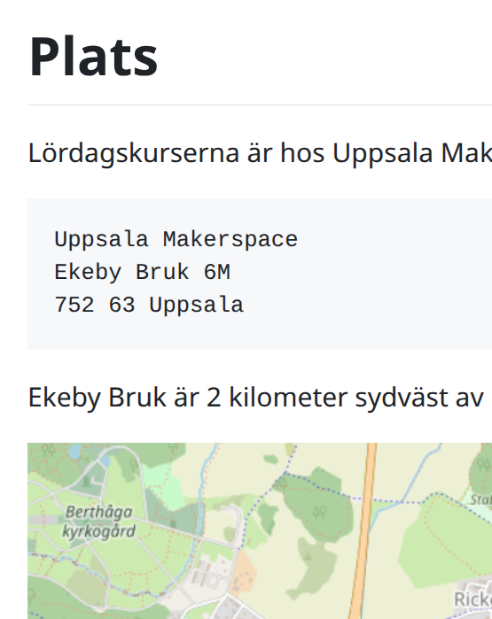

# split_mkdocs_tabs

Convert a MkDocs file to one Markdown file per language tab.

<!-- markdownlint-disable MD013 --><!-- Tables cannot be split up over lines, hence will break 80 characters per line -->

Both                         |English                       |Swedish
-----------------------------|------------------------------|------------------
||

<!-- markdownlint-enable MD013 -->

## The problem it fixes

It is hard to create an MkDocs website for multiple language.
Even when one gets this running, the content is split up in
different folders, with 1 folder per language.

A way to keep content of the different languages together is to use tabs,
with one tab per language.

This R package allows one to split such a page with language
tabs into the different Markdown files, 1 per language.

## Usage

As an input file,
we use [`inst/extdata/example_1.md`](inst/extdata/example_1.md).
This files has tabs for two languages, English and Swedish.
These languages are indicited by an emoji of the flag of their language.
To create one file per language, do:

```r
splimata::split_tabs(
  input_file_name = "inst/extdata/example_1.md",
  output_file_prefix = "inst/extdata/example_1"
)
```

This will create two files:

- [`inst/extdata/example_1_en.md`](inst/extdata/example_1_en.md)
- [`inst/extdata/example_1_sv.md`](inst/extdata/example_1_sv.md)

